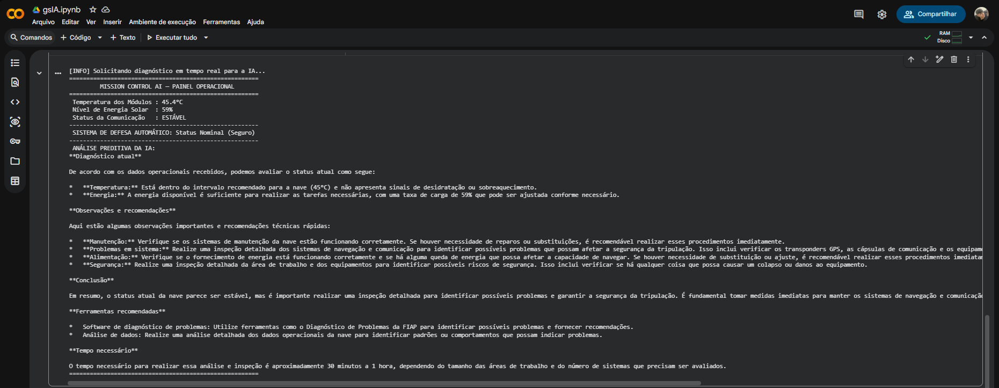
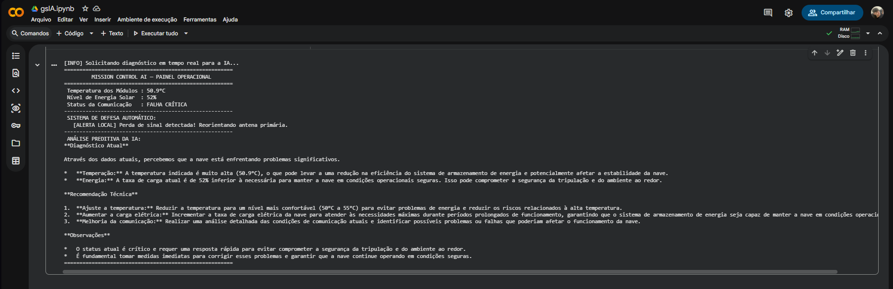

# Mission Control AI — Monitoramento Aeroespacial

**Disciplina:** Prompt and Artificial Intelligence  
**FIAP - Global Solution 2026.1**

## 👥 Integrantes
- Gustavo Russo Balizardo — RM: 569283
- Guilherme Lopes Muniz — RM: 569521

## 📋 Descrição do Projeto
O **Mission Control AI** é um sistema em Python desenvolvido para monitorar variáveis operacionais críticas de uma missão espacial experimental. O software gera dados randômicos simulando a telemetria da nave (temperatura, nível de energia e integridade de comunicação), processa alertas de segurança acionando protocolos de defesa via lógica booleana e integra o modelo de linguagem LLM **Llama 3.2 1B** via **Ollama** para atuar como engenheiro de sistemas especialista, gerando diagnósticos detalhados e insights preditivos em tempo real sobre a integridade da operação.

## 🖥️ Demonstração do Sistema
Abaixo estão os registros do console do sistema operando em diferentes cenários críticos:

### Cenário 1: Status Nominal

*Legenda: Sistema rodando com parâmetros dentro da janela segura de operação.*

### Cenário 2: Alerta Crítico Detectado

*Legenda: Disparo automático de alertas locais combinado com a análise diagnóstica realizada pela IA.*

## 🛠️ Como Executar
O projeto foi desenvolvido para ser executado de forma 100% em nuvem através do Google Colab, sem a necessidade de instalações locais:

1. Acesse o nosso [Notebook no Google Colab].
2. Certifique-se de estar logado em uma conta Google.
3. Vá no menu superior em **Ambiente de Execução** > **Executar tudo** (ou utilize o atalho `Ctrl + F9`).
4. O script instalará o ecossistema do Ollama na instância do Colab, baixará o modelo Llama 3.2 1B e executará os painéis.

## 🎬 Vídeo de Demonstração
Assista ao vídeo explicativo de até 3 minutos contendo a apresentação dos membros da equipe e a execução dos testes ao vivo do script:
👉 https://youtu.be/e08nEWQGfKc
